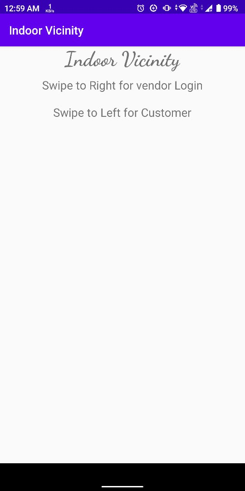
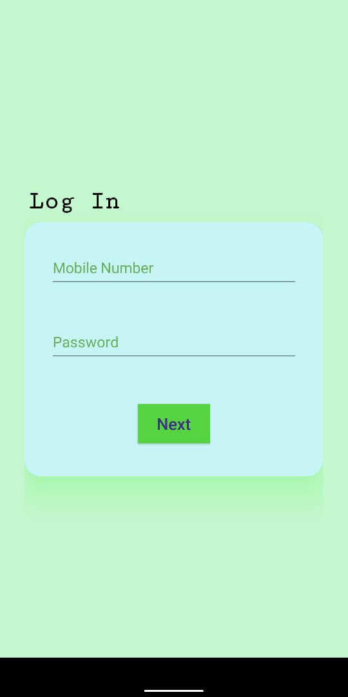
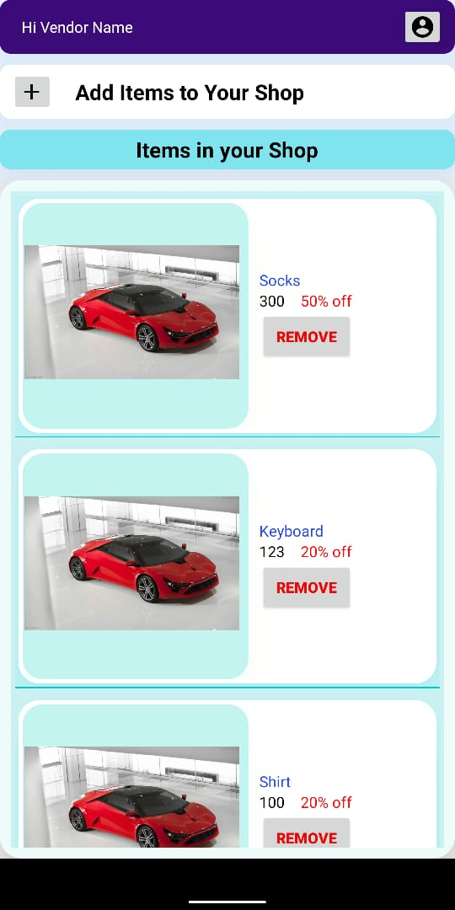
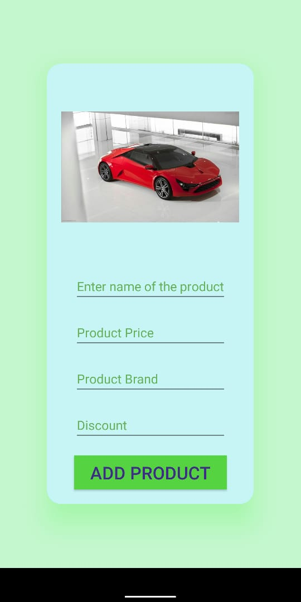
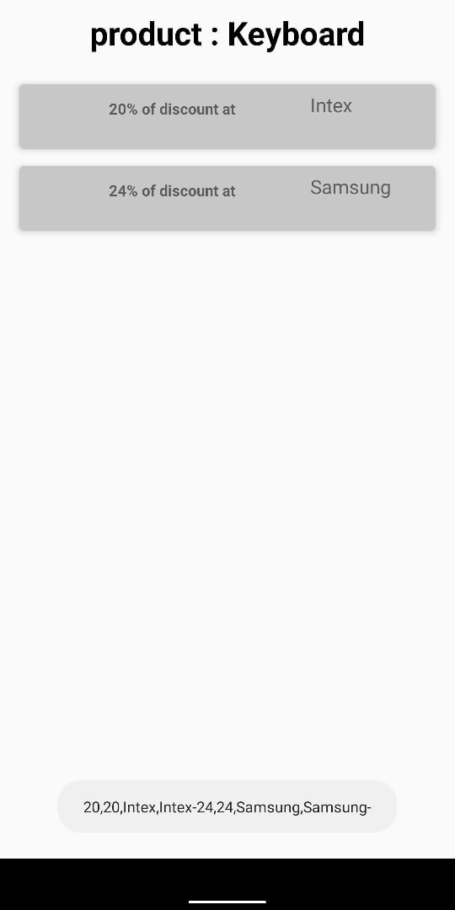

#### There will be 2 users for this application :
> 1. Customer
> 2. Vendor

***Theme***

 Tracking the Indoor Vicinity is an indoor navigation system that is used to navigate the location inside 
the Mall. It stores the data of an area to locate the places requested by the user (customer). This system 
does not use the Global Position System (GPS). The system uses the floor map of the mall and directs 
the user with the help of route using Inertial Sensors. Rather than Mall, this project has a wide area 
of applicability, it can also be expanded to the Campuses, Market Place, Museum, Park, Fort, zoo.
Customers in the shopping mall face difficulties in locating the correct shops for finding the preferred 
products or shops due to the size of shopping malls and navigation challenges. As a solution to this 
problem considering the Win-Winn situation for customers as well as businessmen, A mobile 
application for indoor navigation to reach each corner of the mall can be designed. To display/ 
showcase the shop’s offers /discounts to reach each customer. Also, Customers can find the appropriate 
shop of their choice and the app can help them to navigate 

***Why Inertial Sensors***

I also tried coordinates to find exact location but that too didn't work at small variance in movement 
I also tried using Augmented Reality as nowdays smartphones can measure size of object using thier camera only, so I was following that API ealier, but later on I realized that ARCORE is supported in only high end devices 
So to make the application scalable, I decided to go with inertial sensing technology that is supported by most other phones.

The step sensors counts the distance you travelled and magnetometer helps you to know which direction you are moving. It works similar to a compass application working on your phone.

There is also barometer support but again that is available on high end devices but that can help you to find out which floor you are, but if it is not supported on your device, then its fine, still you may use rest of the features

***Working Modules***

There is a vendor who needs to Sign IN to add products to his shop 
Then customer need not to sign in, he can just check what are the prodcuts inside all shops of the mall and can compare the discount rates

Following technologies are used:

> 1. Android
>> - Java
>> - Volley Library
>> - GMS Library
>> - QR Code Scanner

> 2.  PHP for making RESTFUL services to communicte with the database

# Schreenshots
  
  ***Below are some screenshots of the application**
Landing Page | Login Page
--- | ---
 | 

Vendor Home Page | Vendor Add Product
--- | ---
 | 

Vendor Home Page | Vendor Add Product
--- | ---
 | 

  

